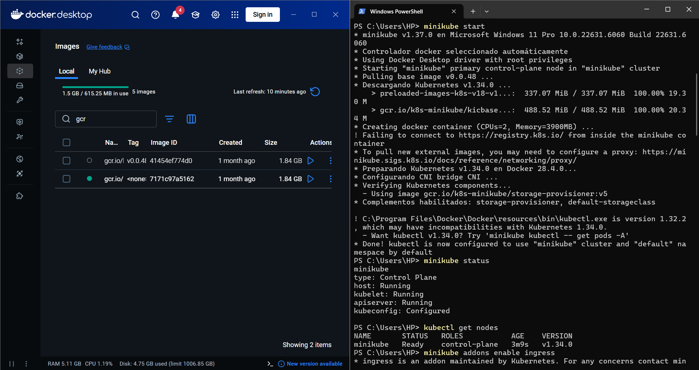
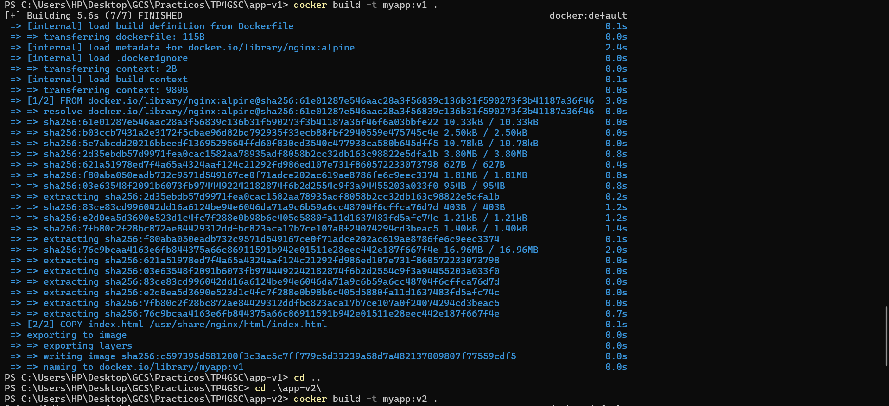
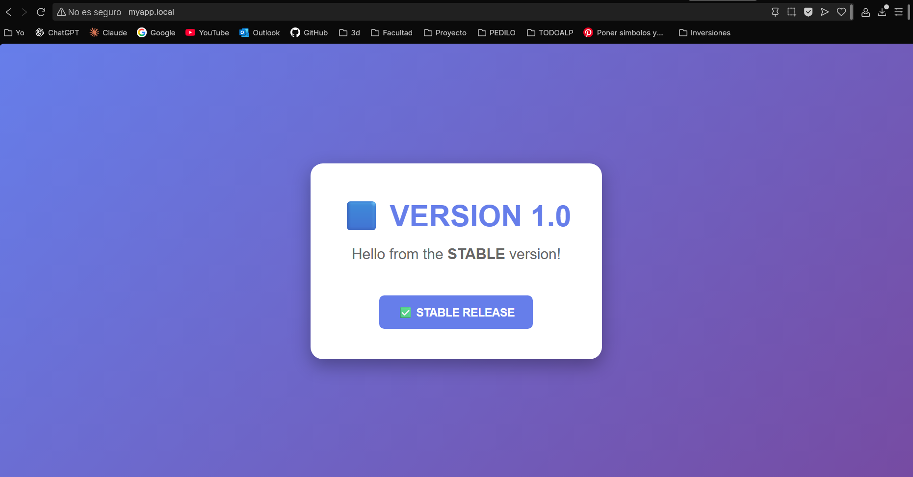
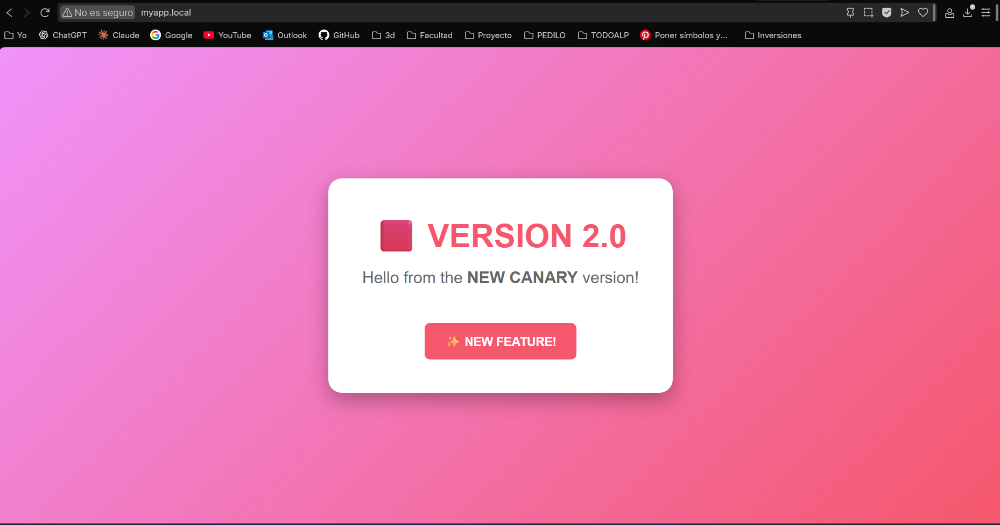
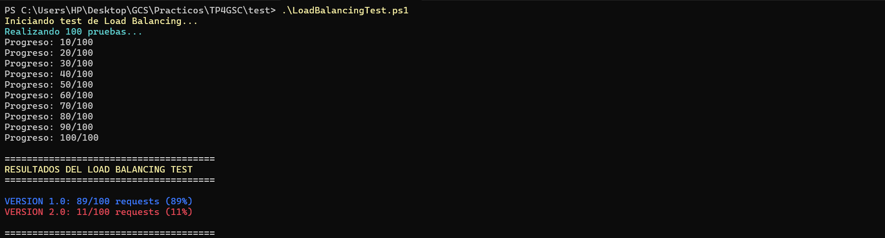
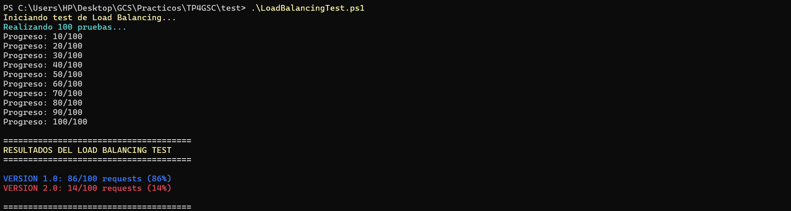

# 🐦 Canary Release con Kubernetes - Trabajo Práctico

> Implementación de estrategia de despliegue Canary Release utilizando Kubernetes (Minikube) e NGINX Ingress Controller

## 📋 Tabla de Contenidos

- [Descripción del Proyecto](#descripción-del-proyecto)
- [Requisitos Previos](#requisitos-previos)
- [Estructura del Proyecto](#estructura-del-proyecto)
- [Instalación y Configuración](#instalación-y-configuración)
- [Uso](#uso)
- [Progresión del Canary](#progresión-del-canary)
- [Conceptos Teóricos](#conceptos-teóricos)
- [Troubleshooting](#troubleshooting)
- [Referencias](#referencias)

---

## 🎯 Descripción del Proyecto

Este proyecto implementa una **estrategia de despliegue Canary Release** que permite liberar nuevas versiones de software de manera gradual y controlada, minimizando el riesgo de impacto negativo en los usuarios finales.

### **¿Qué es Canary Release?**

Canary Release es una técnica de despliegue progresivo donde una nueva versión del software se libera a un pequeño porcentaje de usuarios antes de desplegarse completamente. El nombre proviene de los "canarios en las minas de carbón" que servían como sistema de alerta temprana.

### **Componentes del Sistema**

- **Versión 1 (V1)**: Versión estable en producción (fondo azul/morado)
- **Versión 2 (V2)**: Nueva versión con características mejoradas (fondo rosa/rojo)
- **NGINX Ingress**: Controlador que distribuye el tráfico según porcentajes configurados
- **Kubernetes**: Orquestador que gestiona los contenedores y servicios

---

## 🛠️ Requisitos Previos

### **Software Necesario**

- [Docker Desktop](https://www.docker.com/products/docker-desktop/) (Windows/Mac) o Docker Engine (Linux)
- [Minikube](https://minikube.sigs.k8s.io/docs/start/)
- [kubectl](https://kubernetes.io/docs/tasks/tools/)
- Git (opcional, para clonar el repositorio)

### **Verificar Instalación**

```powershell
# Verificar Docker
docker --version

# Verificar Minikube
minikube version

# Verificar kubectl
kubectl version --client
```

---

## 📁 Estructura del Proyecto

```
canary-release/
│
├── README.md                      # Este archivo
├── EVIDENCIAS.md                  # Documentación de evidencias del TP
│
├── app-v1/                        # Aplicación Versión 1
│   ├── Dockerfile
│   └── index.html
│
├── app-v2/                        # Aplicación Versión 2
│   ├── Dockerfile
│   └── index.html
│
├── deployments/
│   ├── deployment-v1.yaml         # Deployment de V1 (2 réplicas)
│   └── deployment-v2.yaml         # Deployment de V2 (2 réplicas)
│
├── services/
│   ├── service-v1.yaml            # Service para V1
│   └── service-v2.yaml            # Service para V2
│
└── ingress/                           # Manifiestos de Kubernetes
    ├── ingress-production.yaml    # Ingress principal (100% V1)
    └── ingress-canary.yaml        # Ingress canary (% configurable a V2)
```

---

## ⚙️ Instalación y Configuración

### **Paso 1: Iniciar Minikube**

```powershell
# Iniciar cluster de Kubernetes
minikube start

# Habilitar addon de Ingress
minikube addons enable ingress  ## Sirve para activar el controlador Ingress en Minikube

# Verificar que está corriendo
minikube status
```


### **Paso 2: Configurar Docker de Minikube**

```powershell
# Configurar terminal para usar Docker de Minikube
minikube docker-env | Invoke-Expression
```

**⚠️ IMPORTANTE:** Este comando debe ejecutarse en cada nueva terminal que uses.

### **Paso 3: Construir las Imágenes Docker**

```powershell
# Construir imagen V1
cd app-v1
docker build -t myapp:v1 .
cd ..

# Construir imagen V2
cd app-v2
docker build -t myapp:v2 .
cd ..

# Verificar que las imágenes se crearon
docker images | findstr myapp
```


### **Paso 4: Desplegar en Kubernetes**

```powershell
kubectl apply -f deployments/deployment-v1.yaml
kubectl apply -f deployments/deployment-v2.yaml
kubectl apply -f services/service-v1.yaml
kubectl apply -f services/service-v2.yaml
kubectl apply -f ingress/ingress-production.yaml
kubectl apply -f ingress/ingress-canary.yaml
```


### **Paso 5: Configurar Acceso Local**

Edita el archivo `hosts` como **Administrador**:
- **Windows:** `C:\Windows\System32\drivers\etc\hosts`
- **Linux/Mac:** `/etc/hosts`

Agrega la siguiente línea:

```
127.0.0.1 myapp.local
```

### **Paso 6: Iniciar Túnel de Minikube**

En una **nueva terminal** (mantenerla abierta):

```powershell
minikube tunnel
```

---

## 🚀 Uso

### **Verificar el Despliegue**

```powershell
# Ver todos los pods (debe haber 4: 2 de V1 y 2 de V2)
kubectl get pods -l app=myapp

# Ver services
kubectl get services

# Ver ingress
kubectl get ingress

# Ver detalles del ingress canary
kubectl describe ingress myapp-canary
```

### **Acceder a la Aplicación**

Abre tu navegador y visita:
```
http://myapp.local
```

O desde la terminal:

```powershell
curl http://myapp.local
```





### **Script de Pruebas (PowerShell)**

Ejecuta el test de peticiones para ver la distribución del tráfico:

**Este test solo sirve para windows**
```powershell
./test/Test-Ingress.ps1
```

---

#### V1: 95% - V2: 5% 


## 📊 Progresión del Canary

### **Cambiar el Porcentaje de Tráfico Canary**

Por defecto, el ingress canary está configurado con **5%** de tráfico a V2.

#### Editando directamente el archivo**

1. Abre `ingress/ingress-canary.yaml`
2. Cambia el valor de `nginx.ingress.kubernetes.io/canary-weight: "5"`
3. Aplica los cambios:
   ```powershell
   kubectl apply -f k8s/ingress-canary.yaml
   ```

### **Verificar el Cambio**

```powershell
# Ver la configuración actual
kubectl get ingress myapp-canary -o yaml

# O con describe
kubectl describe ingress myapp-canary
```


### **Tabla de Progresión Sugerida**

| Etapa | V1      | V2     | Duración Sugerida | Objetivo                          |
|-------|---------|--------|-------------------|-----------------------------------|
| 1     | 95%     | 5%     | 1-2 horas         | Detección temprana de problemas   |
| 2     | 90%     | 10%    | 2-4 horas         | Validación inicial                |
| 3     | 85%     | 15%    | 4-6 horas         | Confianza creciente               |
| 4     | 70%     | 30%    | 6-12 horas        | Validación extendida              |
| 5     | 50%     | 50%    | 12-24 horas       | Distribución equilibrada          |
| 6     | 0%      | 100%   | Permanente        | Migración completa                |

---
#### V1: 90% - V2: 10% 

#### V1: 85% - V2: 15% 

#### V1: % - V2: 30% 

#### V1: % - V2: 100% 


## 🧠 Conceptos Teóricos

### **Relación con Atributos de Calidad ISO 9126**

#### **1. Fiabilidad**

El Canary Release mejora la fiabilidad mediante:

$$MTBF_{canary} > MTBF_{big\_bang}$$

Donde:
- **MTBF** = Mean Time Between Failures (Tiempo Medio Entre Fallos)
- Al desplegar gradualmente, detectamos fallos antes de que afecten a todos los usuarios

#### **2. Disponibilidad**

$$Disponibilidad = \frac{MTBF}{MTBF + MTTR}$$

Donde:
- **MTTR** = Mean Time To Repair (Tiempo Medio de Reparación)
- Canary permite MTTR más bajo porque el rollback es inmediato

#### **3. Impacto Controlado**

$$Usuarios_{afectados} = Usuarios_{totales} \times \frac{Peso_{canary}}{100}$$

**Ejemplo:** Con 10,000 usuarios y canary-weight = 5%:
- Usuarios afectados por un bug = 10,000 × 0.05 = **500 usuarios**
- Versus despliegue tradicional = **10,000 usuarios** (20x más riesgo)

### **Ventajas del Canary Release**

1. **Reducción de Riesgo:** Problemas afectan solo a un porcentaje de usuarios
2. **Detección Temprana:** Se identifican bugs antes del despliegue completo
3. **Rollback Rápido:** Cambiar el peso a 0% es instantáneo
4. **Testing en Producción:** Usuarios reales validan la nueva versión
5. **Confianza Gradual:** Aumentas el porcentaje a medida que ganas confianza

### **Desventajas y Consideraciones**

1. **Complejidad Adicional:** Requiere infraestructura más sofisticada
2. **Recursos Duplicados:** Ambas versiones corren simultáneamente
3. **Monitoreo Necesario:** Debes observar métricas de ambas versiones
4. **Inconsistencia Temporal:** Usuarios diferentes ven versiones diferentes

### **Conexión con Requerimientos No Funcionales**

- **Performance:** Monitorea latencia de V1 vs V2
- **Seguridad:** Valida que V2 no introduce vulnerabilidades
- **Escalabilidad:** Verifica que V2 maneja la carga correctamente
- **Observabilidad:** Logs y métricas diferenciados por versión

---

## 🧪 Comandos Útiles

### **Monitoreo**

```powershell
# Ver todos los recursos
kubectl get all

# Watch pods en tiempo real
kubectl get pods -w

# Ver logs de un pod específico
kubectl logs <nombre-pod>

# Ver logs de V1
kubectl logs -l version=v1

# Ver logs de V2
kubectl logs -l version=v2

# Ver eventos del cluster
kubectl get events --sort-by=.metadata.creationTimestamp
```

### **Limpieza**

```powershell
# Eliminar individualmente
kubectl delete deployment myapp-v1 myapp-v2
kubectl delete service myapp-v1 myapp-v2
kubectl delete ingress myapp-production myapp-canary

# Detener Minikube
minikube stop

# Eliminar cluster completo
minikube delete
```

### **Información del Sistema**

```powershell
# Ver recursos disponibles
kubectl top nodes

# Ver uso de pods (requiere metrics-server)
minikube addons enable metrics-server
kubectl top pods

# Ver configuración del cluster
kubectl cluster-info
```

---

## 📚 Referencias

### **Documentación Oficial**

- [Kubernetes Deployments](https://kubernetes.io/docs/concepts/workloads/controllers/deployment/)
- [Kubernetes Services](https://kubernetes.io/docs/concepts/services-networking/service/)
- [Kubernetes Ingress](https://kubernetes.io/docs/concepts/services-networking/ingress/)
- [NGINX Ingress Controller - Canary Deployments](https://kubernetes.github.io/ingress-nginx/examples/canary/)
- [Minikube Documentation](https://minikube.sigs.k8s.io/docs/)

### **Lecturas Complementarias**

- [Kubernetes Blog - Canary Deployment Explained](https://kubernetes.io/blog/2020/12/02/what-is-canary-deployment/)
- [Martin Fowler - Canary Release](https://martinfowler.com/bliki/CanaryRelease.html)
- [Google SRE Book - Release Engineering](https://sre.google/sre-book/release-engineering/)

### **Libros**

- **Software Engineering** - Ian Sommerville
  - Capítulo 22: Project Management
  - Capítulo 24: Quality Management
- **Site Reliability Engineering** - Google
  - Capítulo 8: Release Engineering

---

## 👥 Autores

**Trabajo Práctico 4 - Gestión y Calidad de Software**
- Materia: Gestión y Calidad de Software
- Lenox Graham
- Franco Mamani
- Rodrigo Vargas
- Mateo Rodriguez
