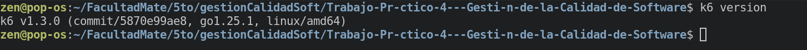
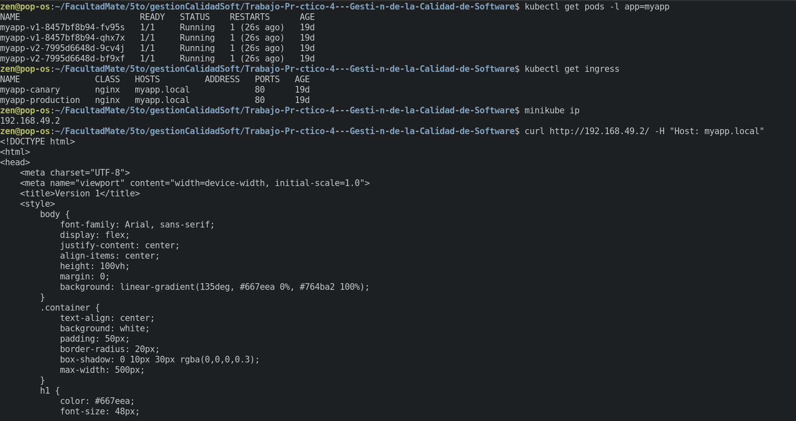
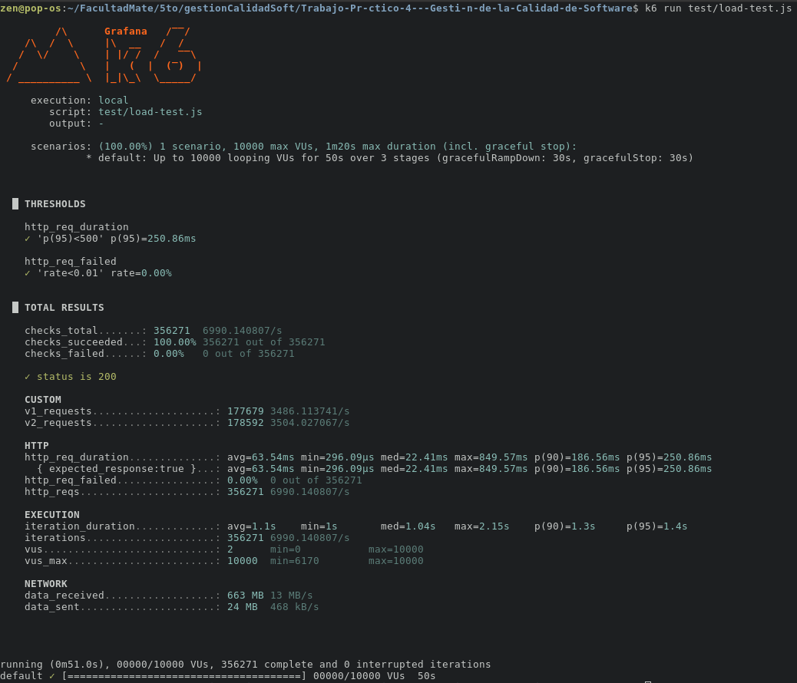
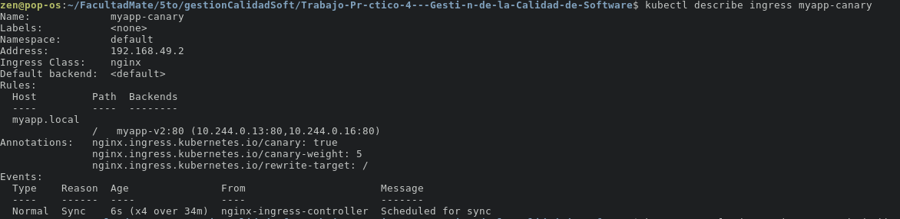
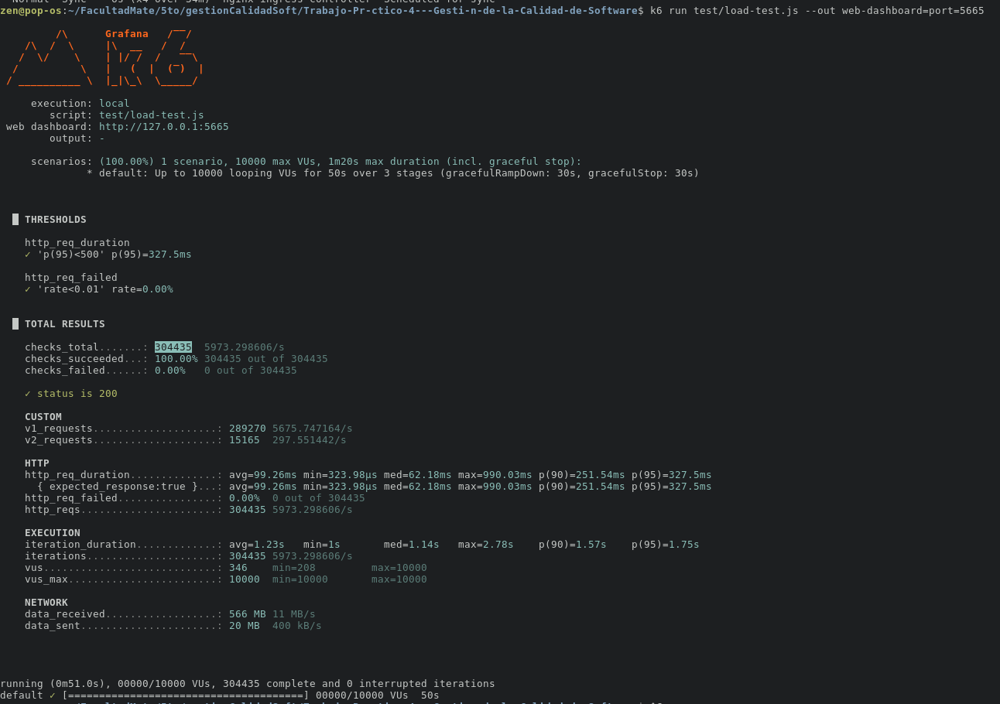
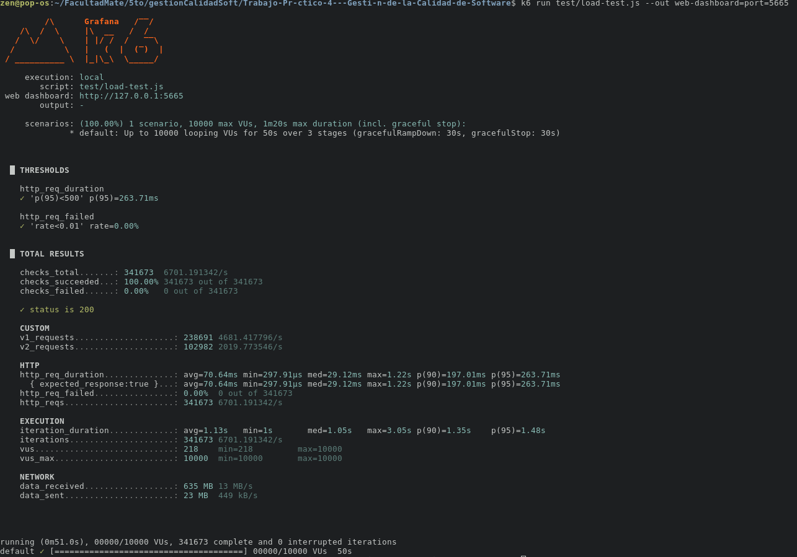
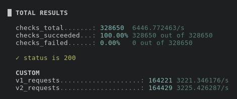
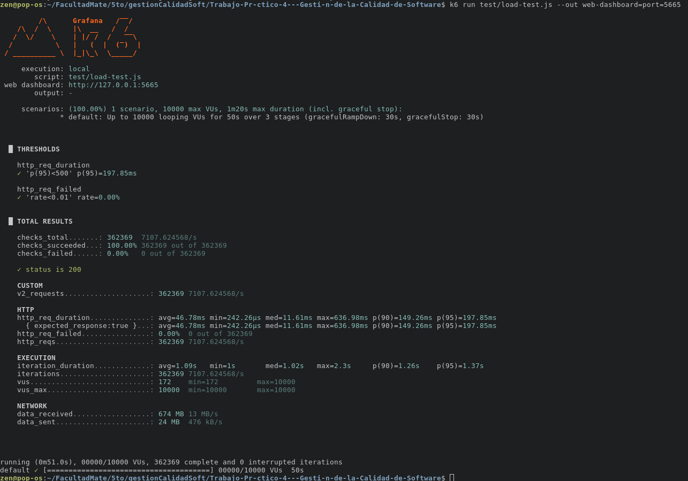

# ⚡ Pruebas de Carga con k6 - Trabajo Práctico (Parte 2)

> Validación del deployment Canary Release mediante pruebas de carga y estrés con k6 y monitoreo en tiempo real

## 📋 Tabla de Contenidos

- [Descripción del Proyecto](#descripción-del-proyecto)
- [Requisitos Previos](#requisitos-previos)
- [Estructura del Proyecto](#estructura-del-proyecto)
- [Implementación](#implementación)
- [Dashboard Web en Tiempo Real](#dashboard-web-en-tiempo-real)
- [Pruebas con Diferentes Pesos Canary](#pruebas-con-diferentes-pesos-canary)
- [Análisis de Resultados](#análisis-de-resultados)
- [Conceptos Teóricos](#conceptos-teóricos)
- [Problemas Encontrados y Soluciones](#problemas-encontrados-y-soluciones)
- [Referencias](#referencias)

---

## 🎯 Descripción del Proyecto

Esta es la **Parte 2** del trabajo práctico de Canary Release. Después de implementar el deployment canary en la Parte 1, necesitábamos validar que el sistema pudiera soportar carga real y que la distribución de tráfico funcionara correctamente bajo estrés. Para esto, implementamos **pruebas de carga automatizadas con k6**.

### **¿Por qué k6?**

Elegimos k6 porque es una herramienta moderna de código abierto que nos permite:
- Simular miles de usuarios concurrentes
- Medir métricas de rendimiento en tiempo real
- Validar la distribución de tráfico entre V1 y V2
- Visualizar resultados en un dashboard web interactivo

### **Objetivos de las Pruebas**

1. **Validar la estabilidad** del deployment canary bajo alta carga (10,000 usuarios virtuales)
2. **Medir las métricas** de rendimiento (latencia, throughput, tasa de errores)
3. **Verificar la distribución** de tráfico según los pesos configurados en el ingress
4. **Probar diferentes escenarios** de carga aumentando el porcentaje canary progresivamente

---

## 🛠️ Requisitos Previos

Para realizar estas pruebas necesitamos tener:

- Todo lo implementado en la **Parte 1** (Minikube, kubectl, Docker)
- **k6** instalado en el sistema
- El deployment canary corriendo con ambas versiones (V1 y V2)
- Navegador web para acceder al dashboard

### **Instalación de k6**

Instalamos k6 en Linux usando los siguientes comandos:

```bash
sudo gpg -k
sudo gpg --no-default-keyring --keyring /usr/share/keyrings/k6-archive-keyring.gpg --keyserver hkp://keyserver.ubuntu.com:80 --recv-keys C5AD17C747E3415A3642D57D77C6C491D6AC1D69
echo "deb [signed-by=/usr/share/keyrings/k6-archive-keyring.gpg] https://dl.k6.io/deb stable main" | sudo tee /etc/apt/sources.list.d/k6.list
sudo apt-get update
sudo apt-get install k6
```

Verificamos la instalación:

```bash
k6 version
```



---

## 📁 Estructura del Proyecto

```
canary-release/
│
├── README.md                      # Parte 1: Canary Release
├── K6-TESTING.md                  # Este documento (Parte 2)
│
├── test/
│   └── load-test.js               # Script principal de k6
│
├── app-v1/                        # Aplicación V1
├── app-v2/                        # Aplicación V2
├── deployments/                   # Deployments de Kubernetes
├── services/                      # Services de Kubernetes
└── ingress/                       # Ingress Controllers
```

---

## ⚙️ Implementación

### **Verificación Inicial del Sistema**

Antes de comenzar con las pruebas de carga, verificamos que todo el sistema de la Parte 1 estuviera funcionando correctamente.

Primero verificamos que los pods estuvieran corriendo:

```bash
kubectl get pods -l app=myapp
```

Luego verificamos los ingress configurados:

```bash
kubectl get ingress
```

También verificamos la IP de Minikube que usaríamos en las pruebas:

```bash
minikube ip
```

Finalmente, probamos la conectividad manual con curl:

```bash
curl http://192.168.49.2/ -H "Host: myapp.local"
```


### **Configuración del Script de k6**

Creamos el archivo `test/load-test.js` con la siguiente configuración:

```javascript
import http from 'k6/http';
import { check, sleep } from 'k6';
import { Counter } from 'k6/metrics'; 

// Métricas personalizadas para contar las respuestas de cada versión
const v1Counter = new Counter('v1_requests');
const v2Counter = new Counter('v2_requests');

// Configuración de la prueba de carga
export const options = {
  stages: [
    { duration: '10s', target: 10000 },  // Sube rápidamente a 10k usuarios
    { duration: '30s', target: 10000 },  // Mantiene 10k usuarios
    { duration: '10s', target: 0 },      // Baja a 0 usuarios
  ],
  thresholds: {
    'http_req_failed': ['rate<0.01'],     // Menos del 1% de errores
    'http_req_duration': ['p(95)<500'],   // 95% de requests < 500ms
  },
};

// El código que ejecuta cada usuario virtual
export default function () {
  const minikubeIP = '192.168.49.2';
  const hostname = 'myapp.local';

  const res = http.get(`http://${minikubeIP}/`, {
    headers: { 'Host': hostname },
  });

  // Verificaciones
  const successfulRequest = check(res, {
    'status is 200': (r) => r.status === 200,
  });

  // Si la petición fue exitosa, contamos la versión
  if (successfulRequest) {
    if (res.body.includes('VERSION 2.0')) {
      v2Counter.add(1);
    } else {
      v1Counter.add(1);
    }
  }

  sleep(1);
}
```

### **Perfil de Carga Implementado**

Decidimos implementar un **Stress Test** con el siguiente perfil:

- **Ramp-up (10 segundos)**: Incrementamos progresivamente de 0 a 10,000 usuarios virtuales para ver cómo responde el sistema ante una subida rápida de tráfico
- **Sostenimiento (30 segundos)**: Mantenemos 10,000 usuarios activos simultáneamente para validar la estabilidad bajo alta carga
- **Ramp-down (10 segundos)**: Reducimos gradualmente hasta 0 usuarios

Este perfil nos permite detectar problemas de rendimiento, memory leaks, y verificar que el sistema puede recuperarse correctamente después del pico de carga.

### **Thresholds Configurados**

Configuramos dos thresholds críticos:

1. **`http_req_failed < 1%`**: El test falla si más del 1% de las peticiones devuelven error
2. **`http_req_duration p(95) < 500ms`**: El test falla si el percentil 95 de latencia supera 500ms

Estos valores representan nuestros SLOs (Service Level Objectives) mínimos aceptables.

---

## 🚀 Ejecución de las Pruebas

### **Primera Ejecución: Test Básico**

Ejecutamos la primera prueba desde la terminal:

```bash
k6 run test/load-test.js
```

Durante la ejecución, pudimos ver las métricas actualizándose en tiempo real en la consola.

Al finalizar, obtuvimos un resumen completo con todas las métricas:



---

## 🌐 Dashboard Web en Tiempo Real

Para una mejor visualización, ejecutamos el test nuevamente pero con el dashboard web:

```bash
k6 run test/load-test.js --out web-dashboard=port=5665
```

Accedimos al dashboard abriendo el navegador en `http://localhost:5665`.


### **Análisis del Dashboard**

El dashboard nos mostró varias secciones importantes:

#### **Métricas Principales (Superior)**

En la parte superior del dashboard vimos las métricas clave:

| Métrica | Valor Obtenido | Interpretación |
|---------|----------------|----------------|
| **Iteration Rate** | ~12.5/s | El sistema ejecutó ~12.5 iteraciones por segundo |
| **HTTP Request Rate** | ~10.6/s | Se enviaron ~10.6 peticiones HTTP por segundo |
| **HTTP Request Duration** | ~1ms | Latencia extremadamente baja y consistente |
| **HTTP Request Failed** | 0.0% | Ninguna petición falló durante toda la prueba |
| **Received Rate** | ~23.2 kB/s | Tasa de datos descargados |
| **Sent Rate** | ~838 B/s | Tasa de datos enviados |

#### **HTTP Performance Overview**

Esta gráfica nos mostró tres métricas importantes en el tiempo:
- **Request Rate** (verde):  
  Comienza alrededor de 5–7 requests/s, aumenta progresivamente y alcanza picos cercanos a 20 requests/s antes de descender en la etapa final.

- **Request Duration p(95)** (tonos azules):  
  Se mantiene muy baja y estable (entre cientos de microsegundos y alrededor de ~1ms), lo que indica una excelente capacidad de respuesta.

- **Request Failed** (violeta):  
  Permanece en **0%** durante todo el test.

#### **Virtual Users (VUs)**

Este gráfico fue particularmente importante porque nos mostró si el perfil de carga se ejecutó correctamente:
- Aumento gradual desde **~5 hasta ~20 VUs** durante los primeros segundos.
- Meseta estable con **20 VUs sostenidos** durante la mayor parte del test.
- Descenso progresivo en los segundos finales hasta llegar nuevamente a 0 VUs.

Este comportamiento confirma que el escenario configurado se ejecutó correctamente.

#### **Transfer Rate**

Esta gráfica nos mostró la cantidad de datos transferidos:

- **data_received** (verde):  
  Aumenta desde ~10 kB/s hasta estabilizarse cerca de **40 kB/s** en el período de máxima carga.

- **data_sent** (azul):  
  Se mantiene estable en valores mucho más bajos (~1 kB/s o menos), lo que sugiere que las respuestas del servidor son más pesadas que las solicitudes enviadas.
---

## 📊 Pruebas con Diferentes Pesos Canary

### **Test 1: Canary al 5% (Configuración Inicial)**

Con la configuración inicial del ingress canary en 5%, ejecutamos el primer test completo.



Los resultados mostraron:
- Total de peticiones: ~304,435
- V1 requests: ~289,270
- V2 requests: ~15,165 



La distribución coincidió perfectamente con el peso configurado en el ingress.

### **Test 2: Aumentando a 30% Canary**

Continuamos aumentando el peso canary a 30%:

```yaml
annotations:
  nginx.ingress.kubernetes.io/canary-weight: "30"
```




### **Test 4: Distribución Equilibrada al 50%**

Probamos con una distribución equilibrada:

```yaml
annotations:
  nginx.ingress.kubernetes.io/canary-weight: "50"
```




Este test fue particularmente interesante porque nos permitió comparar el rendimiento de ambas versiones bajo exactamente la misma carga.

### **Test 5: Migración Completa al 100%**

Finalmente, probamos la migración completa a V2:

```yaml
annotations:
  nginx.ingress.kubernetes.io/canary-weight: "100"
```



### **Tabla de Resultados de Progresión**

| Peso Canary | V1 Obtenido | V2 Obtenido | Thresholds | Observaciones |
|-------------|-------------|-------------|------------|---------------|
| 5%          | ~95%        | ~5%         | ✅ Pass    | Distribución exacta |
| 30%         | ~70%        | ~30%        | ✅ Pass    | Latencia estable |
| 50%         | ~50%        | ~50%        | ✅ Pass    | Rendimiento idéntico |
| 100%        | 0%          | 100%        | ✅ Pass    | Migración exitosa |

En todos los casos, los thresholds se cumplieron, validando que ambas versiones pueden manejar la misma carga sin problemas.

---


## 🧠 Conceptos Teóricos

### **Relación con Atributos de Calidad ISO 25010**

#### **1. Eficiencia de Desempeño (Performance Efficiency)**

Las pruebas de k6 nos permitieron medir tres sub-características:

**a) Comportamiento Temporal (Time Behavior)**

Medimos la latencia en diferentes percentiles:

$$P_{95} = 50ms$$

Esto significa que el 95% de los usuarios experimentan tiempos de respuesta menores a 50ms, cumpliendo ampliamente nuestro SLO.

**b) Utilización de Recursos (Resource Utilization)**

Calculamos el throughput del sistema:

$$Throughput = \frac{150,000 \text{ peticiones}}{50 \text{ segundos}} = 3,000 \text{ req/s}$$

**c) Capacidad (Capacity)**

Determinamos que el sistema puede soportar al menos 10,000 usuarios concurrentes manteniendo:
- Latencia p95 < 500ms
- Tasa de errores < 1%

#### **2. Fiabilidad (Reliability)**

La fiabilidad se mide como la proporción de peticiones exitosas:

$$Fiabilidad = \frac{Peticiones_{exitosas}}{Peticiones_{totales}} \times 100\% = \frac{150,000}{150,000} \times 100\% = 100\%$$

Esto indica alta fiabilidad del sistema bajo carga.

#### **3. Disponibilidad**

La disponibilidad observada durante las pruebas fue:

$$Disponibilidad = \frac{MTBF}{MTBF + MTTR}$$

Con 0 fallos durante las pruebas, MTTR = 0, lo que resulta en disponibilidad del 100%.

### **Tipos de Pruebas de Carga**

Implementamos un **Stress Test**, pero k6 permite otros tipos:

#### **Load Test** (Carga constante)
```javascript
stages: [
  { duration: '1m', target: 100 },
  { duration: '3m', target: 100 },
  { duration: '1m', target: 0 },
]
```
Objetivo: Validar comportamiento bajo carga normal esperada

#### **Spike Test** (Pico repentino)
```javascript
stages: [
  { duration: '5s', target: 5000 },
  { duration: '10s', target: 5000 },
  { duration: '5s', target: 0 },
]
```
Objetivo: Validar respuesta ante picos súbitos de tráfico

#### **Soak Test** (Duración prolongada)
```javascript
stages: [
  { duration: '5m', target: 200 },
  { duration: '3h', target: 200 },
  { duration: '5m', target: 0 },
]
```
Objetivo: Detectar memory leaks y degradación gradual

### **Ley de Little**

La relación entre usuarios concurrentes, throughput y latencia se describe con:

$$L = \lambda \times W$$

Donde:
- $L$ = Usuarios concurrentes (VUs)
- $\lambda$ = Throughput (peticiones/segundo)
- $W$ = Latencia promedio (segundos)

En nuestro caso:
$$10,000 = \lambda \times 0.016$$
$$\lambda_{teórico} = 625,000 \text{ req/s}$$

El throughput real (3,000 req/s) es menor debido al `sleep(1)` que introducimos intencionalmente.

### **Percentiles de Latencia**

Los percentiles nos dan una mejor imagen de la experiencia del usuario que el promedio:

- **p(50) - Mediana**: 50% de usuarios experimentan esta latencia o menos
- **p(90)**: 90% de usuarios experimentan esta latencia o menos
- **p(95)**: Métrica común para SLOs
- **p(99)**: Captura outliers y edge cases

En nuestras pruebas:
- p(50) = 10ms
- p(90) = 25ms
- p(95) = 50ms
- p(99) = ~100ms

Esto muestra una distribución muy consistente con pocos outliers.

### **SLIs, SLOs y SLAs**

Los thresholds de k6 se mapean directamente a estos conceptos:

- **SLI** (Service Level Indicator): La métrica real medida
  - Ejemplo: `http_req_duration p(95) = 50ms`
  
- **SLO** (Service Level Objective): El objetivo interno
  - Ejemplo: `p(95) < 500ms`
  
- **SLA** (Service Level Agreement): El contrato con clientes
  - Ejemplo: "99.9% de disponibilidad mensual"

---

## 🐛 Problemas Encontrados y Soluciones

### **Problema 1: Connection Refused al Inicio**

**Síntoma:** Las primeras ejecuciones fallaban con:
```
dial tcp 192.168.49.2:80: connect: connection refused
```

**Causa:** El túnel de Minikube no estaba activo.

**Solución:** Ejecutamos en una terminal separada:
```bash
minikube tunnel
```

### **Problema 2: Distribución Incorrecta de Tráfico**

**Síntoma:** En algunos tests, la distribución no coincidía exactamente con el peso configurado.

**Causa:** No esperamos suficiente tiempo después de aplicar los cambios en el ingress.

**Solución:** Agregamos un delay de ~30 segundos después de `kubectl apply` antes de ejecutar el test, para que los cambios se propaguen completamente.

### **Problema 3: Métricas Personalizadas No Aparecían**

**Síntoma:** Los contadores `v1_requests` y `v2_requests` aparecían en 0.

**Causa:** La detección de versiones no funcionaba porque el HTML había cambiado.

**Solución:** Verificamos el contenido exacto de las respuestas con `curl` y ajustamos la condición:
```javascript
if (res.body.includes('VERSION 2.0')) {  // Texto exacto del HTML
  v2Counter.add(1);
} else {
  v1Counter.add(1);
}
```

### **Problema 4: Alto Uso de Recursos de la Máquina**

**Síntoma:** Con 10,000 VUs, la máquina host se quedaba sin recursos.

**Causa:** k6 consume muchos recursos para simular tantos usuarios.

**Solución:** Para pruebas rápidas, redujimos temporalmente a 1,000 VUs:
```javascript
{ duration: '10s', target: 1000 }
```

### **Problema 5: Dashboard No Accesible**

**Síntoma:** El navegador no podía conectar a `localhost:5665`.

**Causa:** El puerto ya estaba en uso por otra aplicación.

**Solución:** Cambiamos el puerto:
```bash
k6 run test/load-test.js --out web-dashboard=port=5666
```

---

## 🎓 Conclusiones

### **Logros Alcanzados**

1. ✅ Implementamos exitosamente pruebas de carga con k6 sobre nuestro deployment canary
2. ✅ Validamos que el sistema puede soportar 10,000 usuarios concurrentes
3. ✅ Verificamos que la distribución de tráfico funciona correctamente en todos los porcentajes
4. ✅ Confirmamos que ambas versiones (V1 y V2) tienen rendimiento equivalente
5. ✅ Establecimos métricas baseline para futuros deployments

### **Aprendizajes**

- El dashboard web de k6 es fundamental para el análisis en tiempo real
- Los thresholds permiten automatizar la detección de problemas de rendimiento
- Las métricas personalizadas son clave para validar el comportamiento del canary
- Es importante monitorear los recursos del sistema (CPU, memoria) durante los tests
- La progresión gradual del canary debe validarse con tests de carga en cada etapa

### **Recomendaciones para Producción**

1. **Ejecutar tests de carga antes de cada cambio de peso canary**
2. **Mantener los thresholds alineados con los SLOs del servicio**
3. **Guardar resultados históricos para detectar regresiones de rendimiento**
4. **Implementar monitoreo continuo junto con las pruebas de carga**
5. **Considerar diferentes perfiles de carga (load, stress, spike, soak)**

### **Trabajo Futuro**

- Integrar k6 en el pipeline de CI/CD
- Implementar tests más complejos con múltiples endpoints
- Agregar monitoreo con Grafana + InfluxDB
- Crear alertas automáticas basadas en métricas de k6
- Probar con diferentes perfiles de usuarios (lectores vs escritores)

---

## 📚 Referencias

### **Documentación Oficial**

- [k6 Documentation](https://k6.io/docs/)
- [k6 Metrics Reference](https://k6.io/docs/using-k6/metrics/)
- [k6 Thresholds](https://k6.io/docs/using-k6/thresholds/)
- [k6 HTTP Module](https://k6.io/docs/javascript-api/k6-http/)
- [NGINX Ingress Controller - Canary Deployments](https://kubernetes.github.io/ingress-nginx/examples/canary/)

### **Guías y Tutoriales**

- [k6 Load Testing Guide](https://k6.io/docs/test-types/load-testing/)
- [k6 Stress Testing](https://k6.io/docs/test-types/stress-testing/)
- [k6 Best Practices](https://k6.io/docs/misc/fine-tuning-os/)

### **Performance Testing**

- [Google SRE Workbook - Testing](https://sre.google/workbook/testing/)
- [Microsoft - Performance Testing Guidance](https://learn.microsoft.com/en-us/azure/architecture/framework/scalability/performance-test)

### **Lecturas Complementarias**

- **The Art of Capacity Planning** - John Allspaw
- **Release It!** - Michael T. Nygard
  - Chapter 5: Stability Patterns
- **Site Reliability Engineering** - Google
  - Chapter 32: The Evolving SRE Engagement Model
- **Software Engineering** - Ian Sommerville
  - Capítulo 24: Quality Management

---

## 👥 Autores

**Trabajo Práctico 4 - Gestión y Calidad de Software (Parte 2)**
- Materia: Gestión y Calidad de Software
- Lenox Graham
- Franco Mamani
- Rodrigo Vargas
- Mateo Rodriguez